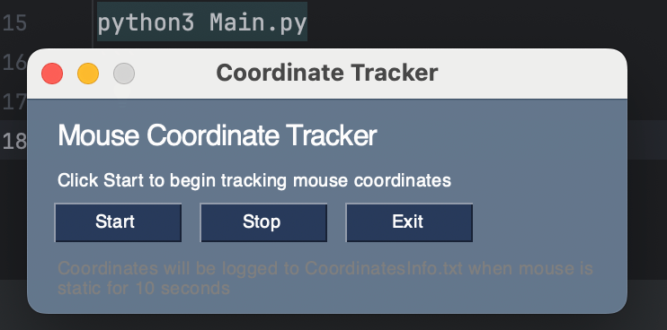
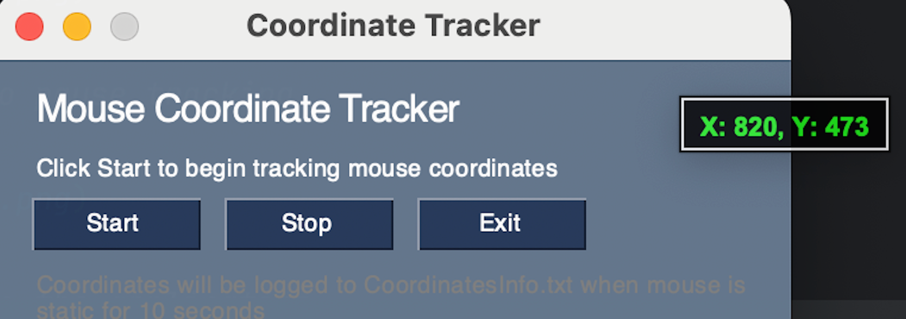
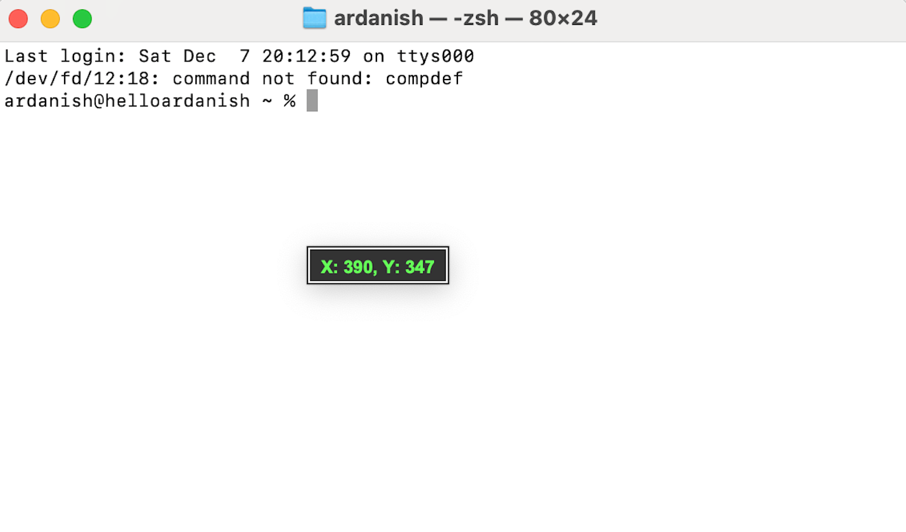
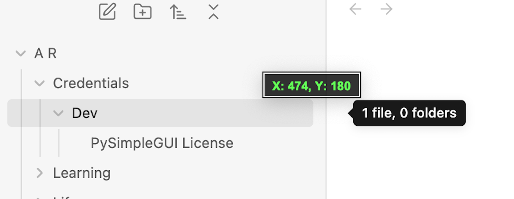
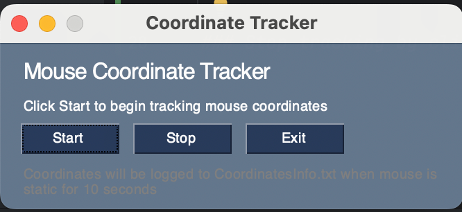

# Mouse Coordinates - Live Track

## Overview
A powerful and user-friendly Python application that provides 
real-time mouse coordinate tracking across multiple displays. 
The tool helps automate processes by making it easy to identify exact screen 
coordinates while providing persistent logging functionality.

## Tools used:  


## Features

### Real-Time Tracking
- Live coordinate display that follows your mouse cursor
- Always-visible floating window that works across multiple displays
- High-contrast display with semi-transparent background for clear visibility
- Automatic edge detection to ensure the coordinate display stays within screen bounds

### Coordinate Logging
- Automatically logs coordinates to `CoordinatesInfo.txt` when the mouse remains stationary
- Captures timestamp and position after 10 seconds of inactivity
- Useful for mapping out automated workflows and UI testing

### User Interface
- Clean, modern interface with start/stop controls
- Minimal footprint with maximum functionality
- Dark theme for reduced eye strain
- Easy-to-use buttons for tracking control

## Technical Details
- Built with Python using PySimpleGUI and Tkinter
- Cross-platform compatibility (Windows, macOS, Linux)
- Thread-safe implementation
- Efficient resource usage

## Getting Started

### Prerequisites

#### Install the dependencies

```bash
pip install -r requirements.txt
```
##### OR manually install
```bash
pip install PySimpleGUI pyautogui
```

### Usage 
#### See [Starting the Application](#starting-the-application)

### Log File Format
Coordinates are logged to `CoordinatesInfo.txt` in the following format:
```
YYYY-MM-DD HH:MM:SS - Position: Point(x=XXX, y=YYY)
```

## Use Cases
- UI Automation scripting
- Identifying screen coordinates for automated testing
- Layout planning for GUI development
- Screen recording and capture setup
- Multi-display configuration

## Tips
- Use the tracking window to precisely identify coordinates for automation scripts
- Keep the log file open to monitor recorded positions
- The semi-transparent display ensures you can see what's underneath while tracking

---

## Starting the application

#### Run the script from project folder
```bash
python3 Main.py
```




---

## Using the application

### Click 'Start' to begin tracking coordinates


Mouse coordinates will display in a floating window near your cursor





Coordinates are automatically logged when the mouse is stationary for 10 seconds



### Click 'Stop' to pause tracking



### 'Exit' to close the application


---

### Happy Coding
## A R